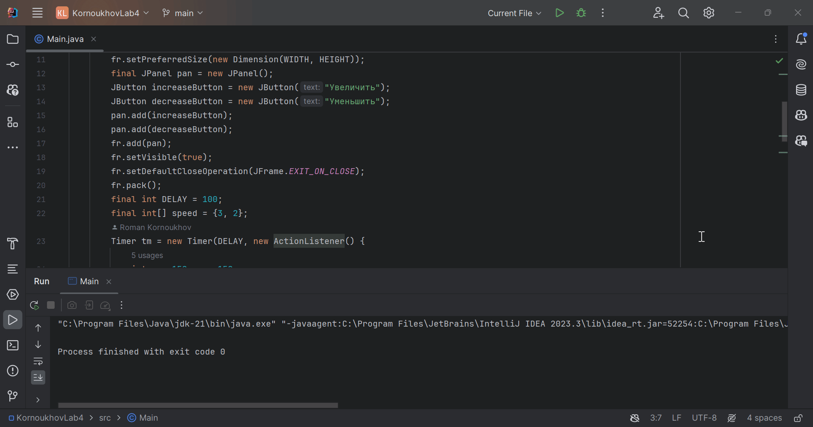

# Лабораторная работа №4
По дисциплине "Объектно-ориентированное программирование".

Выполнил студент группы ПИН-222 Корноухов Роман.

**Вариант 8.** Составить программу для управления скоростью движения точки по апплету. Одна кнопка увеличивает скорость, другая – уменьшает. Каждый щелчок изменяет скорость на определенную величину.

